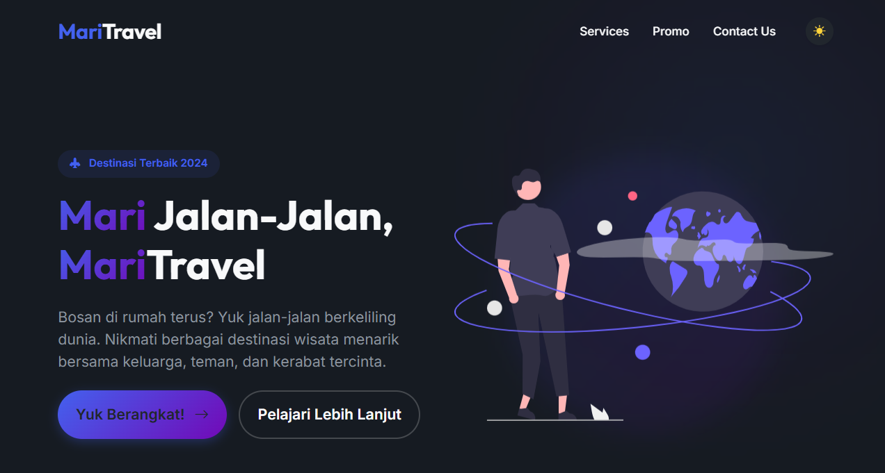

# 🌍 Mari Travel — Jelajahi Dunia Bersama Kami

**Mari Travel** adalah landing page modern untuk agensi perjalanan yang dirancang untuk memberikan pengalaman visual yang memukau bagi calon wisatawan. Dibuat dengan fokus pada estetika premium, responsivitas tinggi, dan kemudahan navigasi.

---

### [🚀 Lihat Live Demo](https://travel-site-teal-rho.vercel.app/)

---

## 📸 Pratinjau Proyek

> [!TIP]
> **Mari Travel** kini mendukung **Dark Mode** yang dinamis! Klik ikon bulan di pojok kanan atas untuk mencoba pengalaman visual yang berbeda.

---

## ✨ Fitur Unggulan

- **🎨 Modern & Premium UI:** Desain bersih dengan sentuhan *glassmorphism*, gradasi warna yang halus, dan tipografi modern.
- **🌓 Dark Mode Support:** Peralihan tema (Light/Dark) yang mulus dengan penyimpanan preferensi di `localStorage`.
- **📱 Ultra Responsive:** Pengalaman maksimal di semua perangkat mulai dari smartphone hingga desktop berkat **Bootstrap 5.3**.
- **🚀 Animasi Halus:** Efek interaktif pada tombol, kartu layanan, dan gambar untuk kesan website yang "hidup".
- **🗺️ Layanan Lengkap:** Section khusus untuk Tiket Pesawat, Penginapan (Hotel/Villa), dan Paket Wisata eksklusif.
- **📩 Newsletter Integration:** Section promo siap pakai untuk menangkap data calon pelanggan.

---

## 🛠️ Teknologi & Resource

| Komponen | Teknologi |
| :--- | :--- |
| **Struktur** | HTML5 (Semantic Labels) |
| **Styling** | CSS3 (Custom Properties & Flexbox) |
| **Framework** | [Bootstrap 5.3](https://getbootstrap.com/) |
| **Iconography** | [Bootstrap Icons](https://icons.getbootstrap.com/) |
| **Typography** | [Google Fonts](https://fonts.google.com/) (Outfit & Inter) |
| **Illustrations** | SVG Optimized Assets |

---

## 🚀 Cara Menjalankan

1. **Clone/Download** repositori ini ke komputer Anda.
2. Pastikan Anda memiliki koneksi internet untuk memuat **Bootstrap CDN** dan **Google Fonts**.
3. Buka file `index.html` menggunakan browser favorit Anda (Chrome, Edge, Firefox).
4. Selesai! Anda bisa menjelajahi fitur-fitur **Mari Travel**.

---

## 🎓 Tujuan Pembelajaran

Proyek ini mulanya terinspirasi dari materi dasar di channel YouTube **[Kelas Terbuka](https://www.youtube.com/@KelasTerbuka)**. Namun, versi ini telah ditingkatkan lebih jauh dengan:
- Implementasi sistem tema (Light/Dark Mode).
- Penggunaan variabel CSS (*CSS Custom Properties*) untuk manajemen warna.
- Layout yang lebih modern dengan teknik desain UI terkini.

---

## 🙌 Credit & Apresiasi

Dibuat dengan ❤️ oleh **Aditya Gaudy Mardiono**.  
Referensi Dasar: **[Kelas Terbuka](https://www.youtube.com/@KelasTerbuka)**

---

  <i>"Menjelajah tanpa batas bersama Mari Travel."</i>

